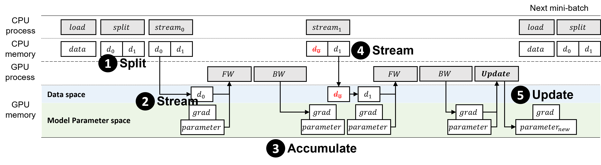

# MICRO_BATCH_STREAMING

## Overview

Recent deep learning models are difficult to train using a large batch size, because commodity machines do not have enough memory to accommodate both the model and a large data size. Thus, this work proposes a framework called Micro-Batch Streaming (MBS) to address this problem. This method helps deep learning models to train by providing a batch streaming method that splits a batch into a size that can fit in the remaining memory and streams them sequentially. A loss normalization algorithm based on the gradient accumulation is used to maintain the performance.

## Models for paper
- Image classification models
    - ResNet-50
        - optimizer : SGD
        - learning rate : 0.1
        - momentum : 0.9
        - decay : 0.0005
    - ResNet-101
        - optimizer : SGD
        - learning rate : 0.1
        - momentum : 0.9
        - decay : 0.0005
- Segmentation models
- 

## Datasets for paper
- Flower-102
- 

## Link for benchmarking
- [ResNet](./benchmark/hw_resnet/)
- [U-Net](./benchmark/unet/)